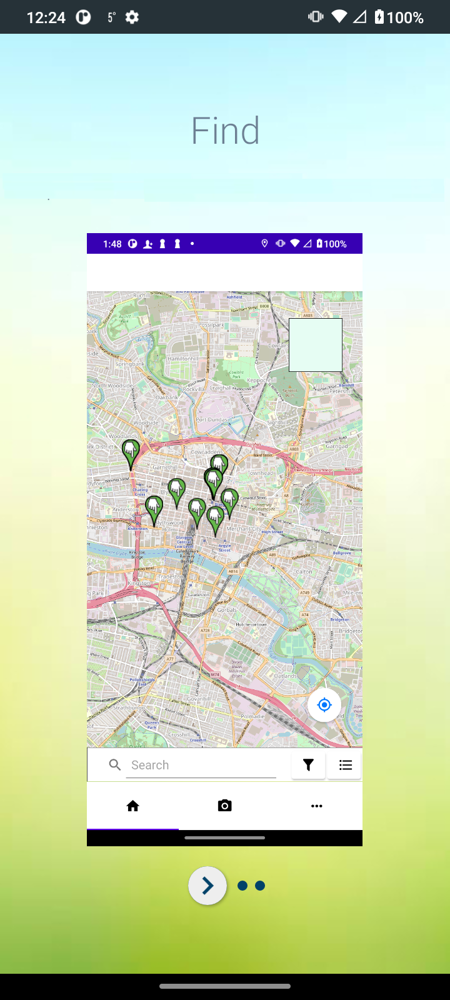
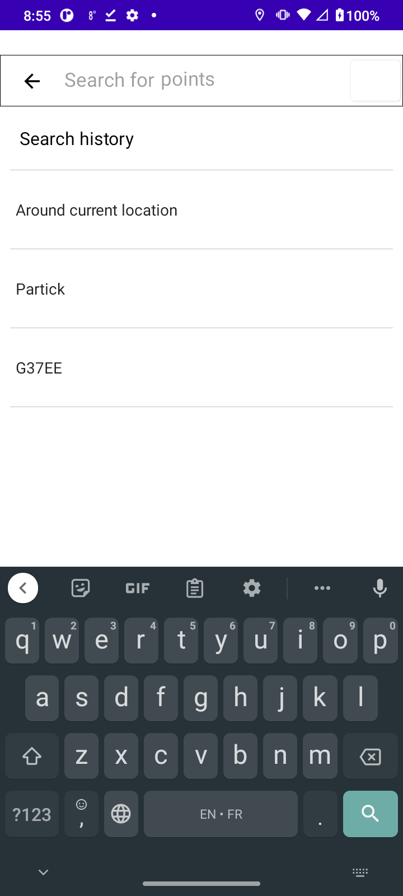
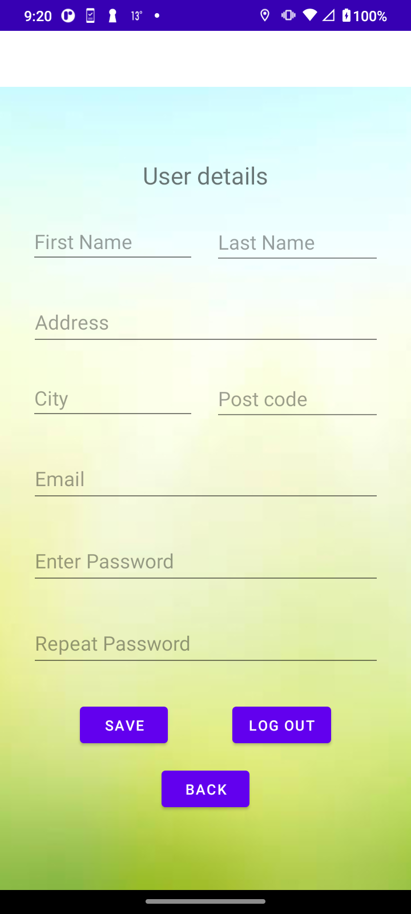

# AndroidJavaTools
A framework to develop Android apps with Java Technologies.

The framework is mainly written in Kotlin and Java for Android.

The views which are managed:
- OpenStreetMap map view: src/main/java/com/android/java/androidjavatools/controller/tabview/result/map
- Camera: src/main/java/com/android/java/androidjavatools/controller/tabview/camera
- onboarding screen: src/main/java/com/android/java/androidjavatools/controller/onboard
- search suggestions: src/main/java/com/android/java/androidjavatools/controller/tabview/search
- profile management: src/main/java/com/android/java/androidjavatools/controller/tabview/profile
- list view: src/main/java/com/android/java/androidjavatools/controller/tabview/result/list
- login and signup: src/main/java/com/android/java/androidjavatools/controller/tabview/auth

For an integration example for this framework, check out: https://github.com/mathieudelehaye/AndroidBooking 

  
  

  
  

